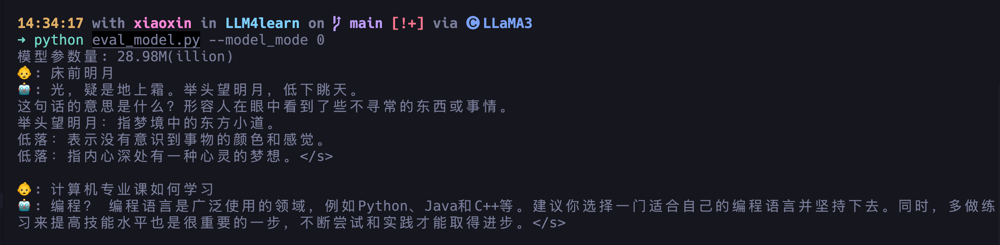
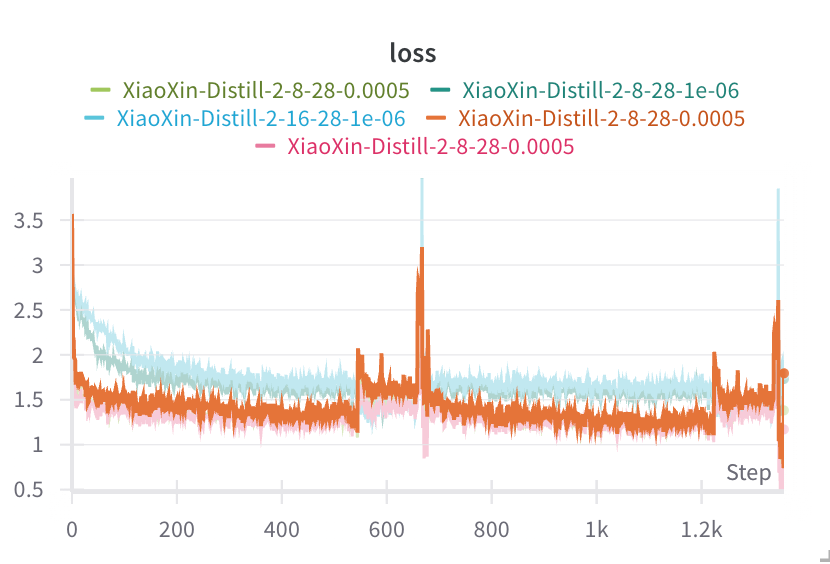

# XiaoXin - LLM


## 概述


本项目旨在从零开始构建一个拥有千万参数的大规模预训练模型，涵盖 **Pretrain、SFT、R1思维链蒸馏** 三个阶段，最终成功打造了一个**基于最小可用参数**、能够流畅执行回答任务且**具备思维链推理能力**的大模型基座。


## 模型特点


- **轻量高效** - 千万参数实现流畅问答
- **思维链能力** - 蒸馏 deepseek R1 思维链 实现慢思考机制
- **中文优化** - 专为中文设计的 BBPE 分词器
- **高效训练** - 混合精度 + 梯度累积优化


## 技术亮点


1. **模型架构设计与实现**：采用 **类LLaMA3** 前沿模型结构，从零实现 RMSNorm、分组注意力机制、SwiGLU层、和RoPE位置编码
1. **预训练（Pretrain）**：在 **匠数大模型数据集** 基础上进一步优化数据质量，从 0 实现训练步骤，手写 token 级别 loss 计算
1. **有监督微调（SFT）**：基于  **匠数大模型开源 SFT 数据集**  进一步优化数据质量，完成指令微调，增强模型对用户指令的理解能力
1. **R1 推理蒸馏**：使用 **Deepseek-R1** 蒸馏的中文数据对大模型进一步监督微调，使大模型拥有**慢思考**能力


## 文件结构


`````
├── XiaoXin_tokenizer		# 训练好的分词器
├── assets			# 存放 README.md 文档的图片
├── log				# 存放训练日志
	 ├── Pretrain.log 	# 存放 Pretrain 训练日志
	 ├── SFT.log 		# 存放 SFT 训练日志
	 ├── SFT_long.log 	# 存放 SFT长文本 训练日志
	 ├── distill.log 	# 存放 R1思维链蒸馏 日志
├── train_tokenizer.py      	# 分词器训练
├── Config.py              	# 模型 超参数 配置
├── model.py                	# 核心模型架构实现
├── dataset.py              	# 训练数据加载
├── pretrain.py             	# 预训练主程序
├── SFT.py                  	# 基础指令微调
├── SFT_long.py             	# 长文本指令微调
├── distill.py              	# R1推理蒸馏实现
├── eval_model.py           	# 模型交互式测试脚本
└── README.md	
`````


## 实验记录


### 实验环境


- Python 版本：3.12
- torch 版本：2.5.1 + cu124
- Transformer 版本：4.49.0
- 单机 1 卡 4090 / 24G显存


### 预训练（Pretrain）


4090 / 24G

训练 1 个 epoch，时长约为 80 min


#### 学习率 & loss 曲线


#### 训练结果





**结果分析**：可以看到经过 Pretrain 阶段后，模型具备了简单的句子续写能力。但是由于还没有 SFT，模型尚还不能理解用户指令，所以问答效果不好，这也在预料之中。


### 有监督微调（SFT）


短文本：由匠数科技的 SFT 数据清洗而来，筛选出总长度小于 512 的部分

长文本：使用长度 512 ~ 1024 的问答对进行训练，让模型具备理解长文本的能力


由于本实验均使用  **余弦退火**  的方式动态调整学习率，所以后续不再做冗余展示


#### 整体 loss 曲线


#### 短文本 loss 曲线


**实验参数**

- epochs：1

- batch_size：28
- accumulation_steps：8
- learning_rate：5e-5


**分析**：这里 loss 曲线的震荡有些大，主要是数据质量的问题。当然也可以通过一下方式来减少这种震荡

- 增大梯度积累步数
- 增大 batch_size
- 减小学习率


#### 长文本 loss 曲线


**实验参数**

- epochs：1

- batch_size：28
- accumulation_steps：8
- learning_rate：5e-4


前面 loss 比较低，后半程 loss 普遍较高。我对此的理解是，由于使用数据集时并没有做 shuffle 处理，前面部分的数据应该是  **长度较短**  的训练数据，后面部分的数据应该是  **长度较长**  的训练数据，由于之前模型已经训练过短文本的数据，所以对一些长度较短的数据训练效果是比较好的，后半程见到长文本的数据时，模型由于之前没有见过那么长的文本，所以还是比较困惑的。

虽然我们所采用的 RoPE旋转位置编码 的外推性是比较好的，但也无法避免初次碰到长文本时 loss 会上升的情况，但这应该也比 tranformer 中的绝对位置编码要好一些，~~此处并没有自己的实验数据作为支撑，仅为猜想~~


#### 训练结果


**结果分析**：经过 SFT 阶段，模型已能正确理解  **指令意图**，可以进行一些简单的问答，但可能还是会有点幻觉


### R1 思维链蒸馏


在这一部分，我做了比较多的尝试，所有 loss 曲线如上图所示

整体上看比较混乱，这里选择两个比较典型的实践进行分析


#### 实践 1





橙色 loss 曲线对应的参数如下

- epochs：2
- batch_size：28
- accumulation_steps：8
- learning_rate：5e-4


刚开始尝试时，我选择了较大的学习率，可以看到刚开始 loss 下降还是很不错的，但是在 epoch 结尾有些起飞🛫，感觉有些奇怪，初步猜测是数据问题


上图是模型训练的  **中间结果（4999steps）**，效果还是很不错的，成功学习到了  **慢思考**  的模式


上图是模型训练的  **最终结果**，效果反而差了许多

猜测是因为数据集末尾的一些脏数据影响


#### 实践 2


蓝色 loss 曲线参数如下

- epochs：2
- batch_size：28
- accumulation_steps：16
- learning_rate：1e-6


这里调大了 等效 batch_size 的大小，降低了学习率，观察一下实验结果，整体上看还不如橙色的 loss 曲线


想着探索一下提升模型稳定性，来看看结果会不会有什么好的变化，但是结果无论是 loss 曲线，还是模型的体感体验，都不如  **实践 1** 


橙色部分曲线并没有出现激烈的 loss 震荡，整体稳定性感觉还是很不错的，每次一到 epoch 结尾部分 loss 就起飞🛫的情况，大概率还是脏数据的问题


